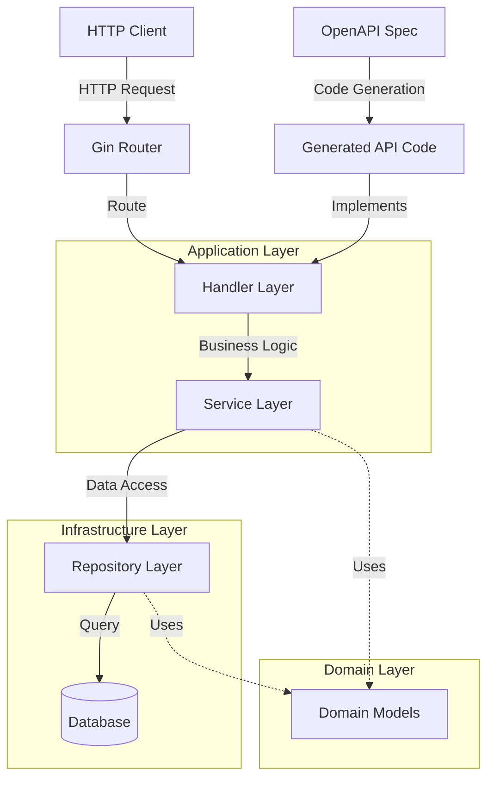

# アーキテクチャ

## システム全体像

```mermaid
graph TB
    Client[HTTP Client] -->|HTTP Request| Router[Gin Router]
    Router -->|Route| Handler[Handler Layer]
    Handler -->|Business Logic| Service[Service Layer]
    Service -->|Data Access| Repository[Repository Layer]
    Repository -->|Query| DB[(Database)]

    OpenAPI[OpenAPI Spec] -->|Code Generation| Generated[Generated API Code]
    Generated -->|Implements| Handler

    subgraph "Application Layer"
        Handler
        Service
    end

    subgraph "Infrastructure Layer"
        Repository
        DB
    end

    subgraph "Domain Layer"
        Domain[Domain Models]
    end

    Service -.->|Uses| Domain
    Repository -.->|Uses| Domain
```
