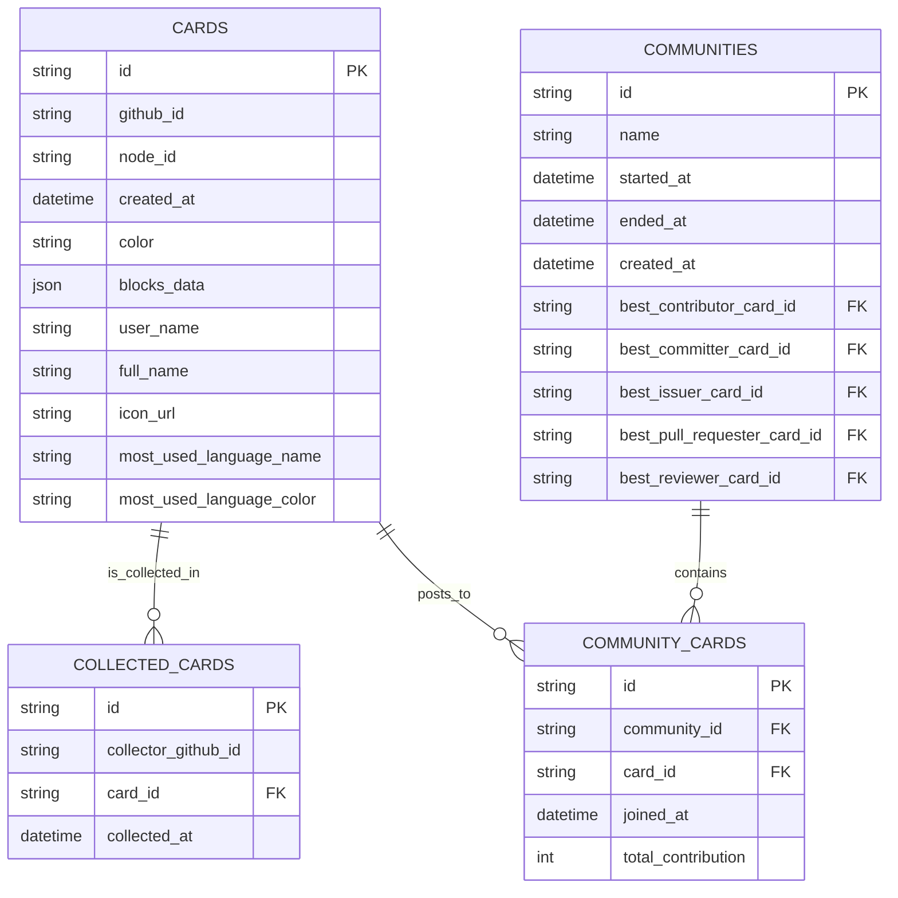

# ER Diagram

```mermaid
erDiagram
    CARDS {
        string id PK
        string github_id
        string node_id
        datetime created_at
        string color
        json blocks_data
        string user_name
        string full_name
        string icon_url
        string most_used_language_name
        string most_used_language_color
    }

    COLLECTED_CARDS {
        string id PK
        string collector_github_id
        string card_id FK
        datetime collected_at
    }

    COMMUNITIES {
        string id PK
        string name
        datetime started_at
        datetime ended_at
        datetime created_at
        string best_contributor_card_id FK
        string best_committer_card_id FK
        string best_issuer_card_id FK
        string best_pull_requester_card_id FK
        string best_reviewer_card_id FK
    }

    COMMUNITY_CARDS {
        string id PK
        string community_id FK
        string card_id FK
        datetime joined_at
        int total_contribution
    }

    CARDS ||--o{ COLLECTED_CARDS : is_collected_in
    CARDS ||--o{ COMMUNITY_CARDS : posts_to
    COMMUNITIES ||--o{ COMMUNITY_CARDS : contains
```
