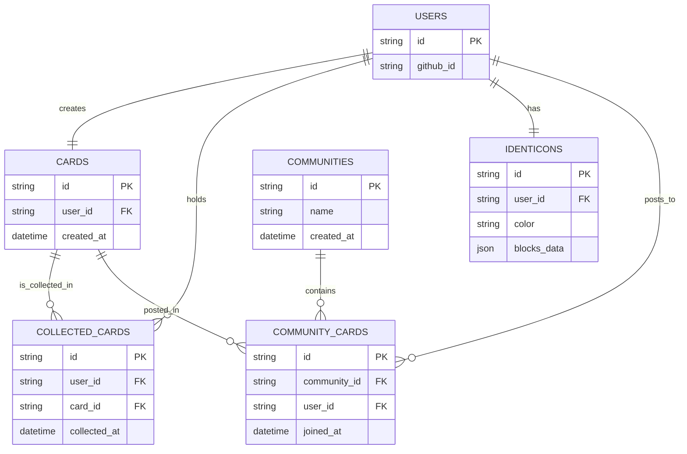

# ER Diagram

```mermaid
erDiagram
    USERS {
        string id PK
        string github_id
    }

    CARDS {
        string id PK
        string user_id FK
        datetime created_at
    }

    COLLECTED_CARDS {
        string id PK
        string user_id FK
        string card_id FK
        datetime collected_at
    }

    IDENTICONS {
        string id PK
        string user_id FK
        string color
        json blocks_data
    }

    COMMUNITIES {
        string id PK
        string name
        datetime created_at
    }

    COMMUNITY_CARDS {
    string id PK
    string community_id FK
    string user_id FK
    datetime joined_at
}

    USERS ||--|| CARDS : creates
    USERS ||--o{ COLLECTED_CARDS : holds
    CARDS ||--o{ COLLECTED_CARDS : is_collected_in
    USERS ||--|| IDENTICONS : has
    USERS ||--o{ COMMUNITY_CARDS : posts_to
    COMMUNITIES ||--o{ COMMUNITY_CARDS : contains
    CARDS ||--o{ COMMUNITY_CARDS : posted_in
```
