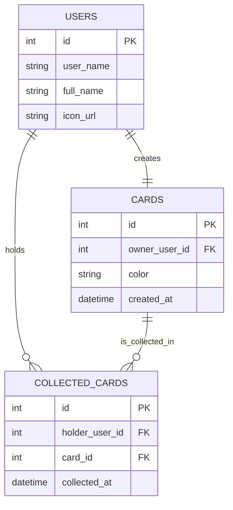

# ER Diagram

```mermaid
erDiagram
    USERS {
        int id PK
        string user_name
        string full_name
        string icon_url
    }

    CARDS {
        int id PK
        int owner_user_id FK
        string color
        datetime created_at
    }

    COLLECTED_CARDS {
        int id PK
        int holder_user_id FK
        int card_id FK
        datetime collected_at
    }

    USERS ||--|| CARDS : creates
    USERS ||--o{ COLLECTED_CARDS : holds
    CARDS ||--o{ COLLECTED_CARDS : is_collected_in
```
