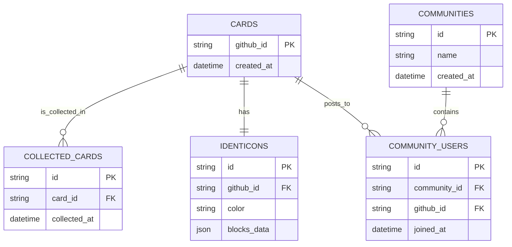

# ER Diagram

```mermaid
erDiagram
    CARDS {
        string github_id PK
        datetime created_at
    }

    COLLECTED_CARDS {
        string id PK
        string card_id FK
        datetime collected_at
    }

    IDENTICONS {
        string id PK
        string github_id FK
        string color
        json blocks_data
    }

    COMMUNITIES {
        string id PK
        string name
        datetime created_at
    }

    COMMUNITY_USERS {
        string id PK
        string community_id FK
        string github_id FK
        datetime joined_at
    }

    CARDS ||--o{ COLLECTED_CARDS : is_collected_in
    CARDS ||--|| IDENTICONS : has
    CARDS ||--o{ COMMUNITY_USERS : posts_to
    COMMUNITIES ||--o{ COMMUNITY_USERS : contains
```
