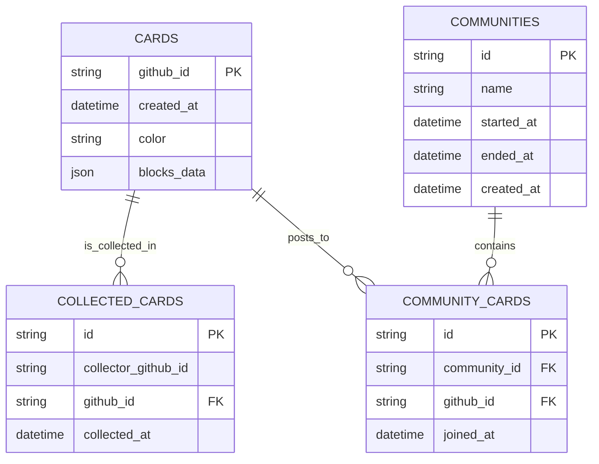

# ER Diagram

```mermaid
erDiagram
    CARDS {
        string github_id PK
        datetime created_at
        string color
        json blocks_data
    }

    COLLECTED_CARDS {
        string id PK
        string collector_github_id
        string github_id FK
        datetime collected_at
    }

    COMMUNITIES {
        string id PK
        string name
        datetime started_at
        datetime ended_at
        datetime created_at
    }

    COMMUNITY_CARDS {
        string id PK
        string community_id FK
        string github_id FK
        datetime joined_at
    }

    CARDS ||--o{ COLLECTED_CARDS : is_collected_in
    CARDS ||--o{ COMMUNITY_CARDS : posts_to
    COMMUNITIES ||--o{ COMMUNITY_CARDS : contains
```
